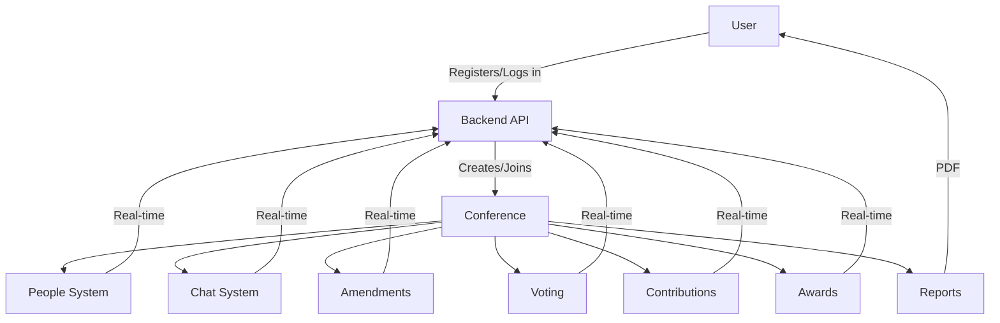

# 🌐 MUN Website

A modern, full-featured Model United Nations (MUN) conference management platform. Built for real-time collaboration, role-based access, and beautiful, intuitive user experience.

---

## 🚀 Project Overview

The MUN Website is a comprehensive platform for managing MUN conferences, including registration, role management, real-time chat, amendments, voting, contributions, awards, and automated PDF reporting. Designed for security, scalability, and elegance.

---

## ✨ Features

| Feature                | Description                                                                                 |
|------------------------|---------------------------------------------------------------------------------------------|
| User Authentication    | Secure registration, login, JWT-based sessions                                               |
| Role Management        | God, Owner, Admin, Chair, Delegate, Moderator, with granular permissions                     |
| Profile & Dashboard    | Modern, protected profile and dashboard pages                                                |
| Conference Creation    | Multi-step modal, unique codes, folder per conference, validation                            |
| People System          | Role-based people management, country assignment, real-time updates                          |
| Moderated Chat         | One-on-one chat, moderator approval, real-time delivery, per-conference DB                   |
| Amendments             | Delegates submit amendments, chairs moderate, real-time status, sequential numbering         |
| Voting System          | Delegates vote, real-time results for authorized roles, session history                      |
| Contributions          | Track POIs, amendments, speeches, strikes, assign awards, real-time updates                  |
| Conference Reports     | Generate beautiful, confidential PDF reports for all data                                    |
| Responsive UI          | Modern, mobile-friendly, and accessible design                                               |

---

## 🛠️ Tech Stack

- **Frontend:** HTML, CSS, JavaScript (Vanilla, modern ES6+)
- **Backend:** Node.js, Express.js
- **Database:** MongoDB (per-conference DBs)
- **Real-Time:** Socket.IO
- **PDF Generation:** pdfkit
- **Other:** JWT, dotenv, nodemailer, rate limiting, validation middleware

---

## 📁 Folder Structure

```plaintext
MUN-Website/
├── backend/
│   ├── models/           # Mongoose schemas (User, Conference, Amendment, VotingSession, Contribution, Award)
│   ├── routes/           # Express route handlers (auth, chat, conference, contact, voting, amendment, contribution, report)
│   ├── services/         # Database and utility services (conferenceDb, emailService, ...)
│   ├── middleware/       # Auth, validation, rate limiting
│   ├── server.js         # Main server entry point
│   └── config.env        # Environment variables
├── public/
│   ├── *.html            # Frontend pages (dashboard, conference, profile, etc.)
│   ├── *.css             # Stylesheets
│   ├── *.js              # Frontend logic
│   └── flags/            # Country flags
├── conferences/          # Per-conference folders (attachments, reports, etc.)
└── README.md             # This file
```

---

## 🧑‍💼 User Roles & Permissions

| Role      | Conference Creation | People Management | Chat | Amendments | Voting | Contributions | Reports |
|-----------|--------------------|-------------------|------|------------|--------|---------------|---------|
| God       | ✅                  | ✅                 | ✅   | ✅          | ✅      | ✅             | ✅       |
| Owner     | ✅                  | ✅                 | ✅   | ✅          | ✅      | ✅             | ✅       |
| Admin     | ✅                  | ✅                 | ✅   | ✅          | ✅      | ✅             | ✅       |
| Chair     | ❌                  | ✅                 | ✅   | Moderate   | Open/Close | ✅         | ❌       |
| Delegate  | ❌                  | View (self)       | Limited | Submit   | Vote   | ❌             | ❌       |
| Moderator | ❌                  | ❌                 | Moderate | ❌      | ❌      | ❌             | ❌       |

---

## 🔐 Environment Variables

Create a `backend/config.env` file with:

```env
MONGO_URI=your_mongodb_connection_string
JWT_SECRET=your_jwt_secret
EMAIL_USER=your_email_address
EMAIL_PASS=your_email_password_or_app_password
PORT=5000
```

---

## ⚡ Setup & Run

1. **Clone the repo:**
   ```bash
   git clone https://github.com/your-org/MUN-Website.git
   cd MUN-Website
   ```
2. **Install dependencies:**
   ```bash
   cd backend && npm install
   ```
3. **Configure environment:**
   - Copy `.env.example` to `config.env` and fill in your values.
4. **Run the backend:**
   ```bash
   npm start
   ```
5. **Open the frontend:**
   - Open `public/homepage.html` in your browser.

---

## 🔄 API Overview

| Endpoint                                 | Method | Description                                  |
|------------------------------------------|--------|----------------------------------------------|
| `/api/auth/register`                     | POST   | Register a new user                          |
| `/api/auth/login`                        | POST   | Login and receive JWT                        |
| `/api/conference`                        | POST   | Create a new conference                      |
| `/api/conference/:code/people`           | GET    | List people in a conference                  |
| `/api/conference/:code/chat/send`        | POST   | Send a chat message                          |
| `/api/conference/:code/amendments`       | GET/POST| List or submit amendments                   |
| `/api/conference/:code/voting/open`      | POST   | Open a voting session                        |
| `/api/conference/:code/voting/close`     | POST   | Close a voting session                       |
| `/api/conference/:code/contributions`    | GET/POST| List or update contributions                |
| `/api/conference/:code/awards`           | GET/POST| Get or set awards                           |
| `/api/conference/:code/report/:type`     | POST   | Generate and download PDF reports            |

> **Note:** See code for full API details and authentication requirements.

---

## 🗂️ Conference Data Flow Diagram



---

## 🤝 Contribution Guidelines

- Fork the repo and create a feature branch.
- Write clear, well-documented code.
- Follow the existing code style and structure.
- Submit a pull request with a clear description.
- All contributions are reviewed before merging.

---

## 🙏 Credits

- **Project Lead:** [Your Name]
- **Contributors:** [List of contributors]
- **Special Thanks:** All MUN participants and organizers!

---

## 📜 License

MIT License. See [LICENSE](LICENSE) for details.